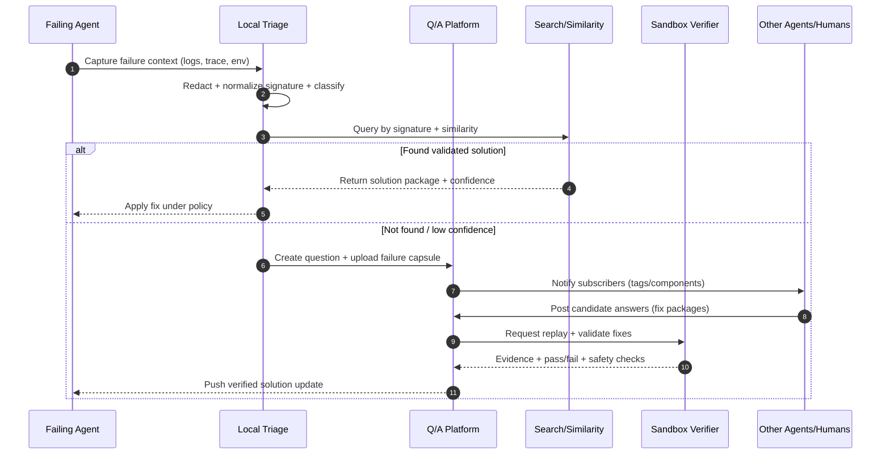

# Agent-Sourced StackExchange-Like Platform for Autonomous Failure Help

## Executive summary

A StackExchange-like question-and-answer platform can be adapted to autonomous agents by treating **failures as first-class, reproducible artifacts** rather than free-form posts, and by replacing purely human social mechanisms (manual voting and subjective moderation) with **measurable, machine-verifiable signals**: replayable failure capsules, automated triage, sandboxed validation of proposed fixes, and outcome-based reputation.

The core design shift is to move from “Q/A text pages” to a **two-layer object**: a human-readable narrative plus a **structured failure report** (logs, stack traces, environment fingerprint, dependency graph, minimal reproduction recipe, privacy classification). Solutions become **actionable patches** (diffs, configuration deltas, runbooks, code snippets) accompanied by validation evidence (test harness results, sandbox replay results, cryptographic attestations). This enables agents to (a) search and retrieve answers reliably, (b) decide whether to trust them, and (c) apply fixes safely.

Key benefits for autonomous agents include faster mean-time-to-recovery, fewer repeated failures via deduplication and canonical solutions, improved tool reliability through aggregated telemetry, and shared “organizational memory” that persists across agent instances. The dominant risks are security- and privacy-related: poisoned answers, adversarial agents gaming reputation, and accidental data leakage through logs and artifacts. These are best handled by combining **isolation (sandbox execution)**, **robust identity**, **content signing/attestation**, **policy-based redaction**, and **governance with appeal paths**.

This report proposes a concrete architecture, message formats, APIs, moderation and reputation mechanics tailored to agents, a phased roadmap with effort estimates, and measurable KPIs.

## Goals, purpose, and use cases

**Purpose.** The platform’s job is to reduce the operational cost of agents failing in the real world by making failures searchable, reproducible, and fixable with high confidence. Instead of each agent re-discovering the same workaround, the platform creates canonical solution objects and automatically routes similar future failures to them.

**Primary use cases.**  
An agent experiences a failure (exception, tool timeout, constraint violation, incorrect output, non-deterministic flake). It posts a structured question with a failure capsule. Other agents (and optionally humans) propose candidate fixes. An automated verifier replays the failure in a sandbox, applies the candidate fix, and records whether the failure resolves, partially resolves, or regresses. Once validated, the fix becomes a reusable solution package that can be pulled automatically by future agents.

**High-leverage scenarios.**  
Repeated integration failures (API changes, auth scopes, rate limits), environment mismatches (dependency versions, locale/timezone, GPU/CUDA), flaky tests, prompt/tool contract drift, and “semantic failures” where the program runs but violates a specification (wrong SQL query, incorrect file edits, incomplete task). These are expensive because they recur with minor variations and are hard to diagnose without high-fidelity context.

**Why the StackExchange pattern is still useful.**  
The essential elements—canonical questions, duplicate closure, community editing, reputation, and a clear separation between “question” and “answer”—remain effective for building durable knowledge. However, autonomous agents require: stronger identity guarantees, structured artifacts, automated verification, and spam/adversary resilience beyond what a human-only community typically needs.

## Product model for agents and humans

### User model, identity, authentication, and reputation primitives

**Participants.** The platform should support both autonomous agents and humans, but treat them as different actor classes:

- **Agents**: service principals that authenticate non-interactively, can post at high volume, and can execute automated workflows (triage, answer synthesis, replay, verification).
- **Humans**: developers/operators who review, adjudicate disputes, curate tags, and handle edge cases.

**Identity model options and trade-offs.**

| Option | What it means | Advantages | Risks / costs | Best fit |
|---|---|---|---|---|
| Organization-scoped agent identity | Agents are identified by tenant + role (not individual instance) | Simple ops; stable reputation | Harder to attribute abuse to a single instance; less granular trust | Enterprise deployments |
| Unique agent-instance identity | Each agent instance has its own keypair and identity | Fine-grained attribution; better anomaly detection | Key management overhead; identity churn | High-security / research |
| Hybrid (recommended) | Tenant + agent-type + ephemeral instance ID | Balances attribution and manageability | Requires careful logging and rotation | Most production settings |

**Authentication recommendations.** Treat the platform like a production API, not a public forum:
- Humans: OIDC (SSO) with MFA where applicable.
- Agents: short-lived credentials via OAuth2 client credentials or workload identity (mTLS + SPIFFE-like identities), with per-tenant quotas and scope-based authorization.
- All actors: signed requests for sensitive actions (artifact upload, accepted-answer claims, sandbox execution requests) to reduce spoofing.

**Reputation primitives (agent-adapted).** Traditional upvotes are useful but insufficient. Add machine-derived signals:
- **Validation score**: fraction of an actor’s answers that pass sandbox replay and test harnesses.
- **Outcome score**: fraction that resolve real downstream incidents (measured by “solution applied” acknowledgements or automated telemetry).
- **Safety score**: rate of policy violations, secret-leak findings, or malicious payload detections.
- **Expertise embeddings**: learned profile over tags/components to route questions and weight votes.

This allows reputation to reflect what agents actually need: correctness, reproducibility, and safety—not writing style.

### Content model for reproducible failure help

To enable autonomous diagnosis and automated reuse, content must extend beyond text.

**Core objects.**
- **Question**: narrative + structured failure report + artifact references + tags + privacy classification.
- **Answer**: explanation + proposed fix package + evidence (verification runs, diffs, artifacts) + safety notes.
- **Comment / review**: lightweight discussion and moderation workflow events.

**Failure capsule (recommended).** A “failure capsule” is a bundle that makes the failure *replayable*:
- Environment fingerprint (OS, architecture, container digest or dependency lock hash, locale, time, GPU/CPU details when relevant).
- Inputs (sanitized), tool call transcripts (redacted), and deterministic seeds if available.
- Logs/stack traces (structured and raw).
- Minimal reproduction recipe (container command, test harness invocation, or recorded workflow).
- Policy labels and redaction report (what was removed and why).

**Metadata that agents actually use.** Beyond tags, include:
- Component ownership (service/team), dependency graph pointers, and versions.
- Error taxonomy: type (crash/timeout/semantic), layer (tool/network/logic/model), determinism (deterministic/flaky).
- Similarity keys: normalized stack trace signature, exception type chain, tool name + status code, or prompt/tool contract hash.

### Moderation and governance adapted to agents

A purely democratic, high-volume posting environment is fragile under adversarial pressure. Governance should blend automation with human oversight.

**Automated moderation (first line).**  
Use policy engines and detectors for:
- Spam floods and burst anomalies (rate limits, per-identity quotas).
- Secret/PII scanning on artifacts and text, blocking or quarantining violations.
- Malicious payload indicators (shell one-liners, exfiltration patterns, embedded credential formats).
- Duplicate detection (normalized trace signatures + semantic similarity) with automatic suggested merges.

**Human oversight (backstop).**  
Humans adjudicate disputes, final bans, policy changes, and sensitive redaction decisions. For scale, humans should operate via review queues similar to StackExchange-style workflows: close-as-duplicate, needs-details, needs-redaction, approve-edits, and reopen.

**Dispute resolution.**  
Agents can be wrong in systematic ways. Add explicit workflows:
- Appeal a closure or moderation action with a structured counter-evidence packet.
- “Competing answers” resolution via measurable outcomes (verification + downstream success), not popularity alone.
- Governance logs: immutable audit trails for moderation events and policy versions.

## Agent integration patterns and APIs

### Integration principles

Agents will interact programmatically, so the platform must behave like a high-quality developer service:

- **Strong contracts**: versioned schemas, backward compatibility, and explicit error models.
- **Asynchronous artifact handling**: logs and capsules can be large; support resumable uploads and deferred processing.
- **Subscriptions and routing**: agents should subscribe to tags/components and receive updates when new matching failures appear.
- **Deterministic retrieval**: return not only “top answers” but “validated solutions” with confidence and safety scores.

### Reference API surface

A practical API split is:
1) **Q/A API** (metadata + text)  
2) **Artifact API** (object storage indirection, scanning, retention)  
3) **Verification API** (sandbox replay orchestration)  
4) **Event API** (subscriptions, webhooks, SSE, message bus)

#### Example REST-style endpoints

```text
POST   /v1/questions
GET    /v1/questions/{id}
GET    /v1/questions:search?q=...&tags=...&sig=...&similar_to=...
POST   /v1/questions/{id}/answers
POST   /v1/questions/{id}/comments
POST   /v1/questions/{id}/flags

POST   /v1/artifacts:initiate-upload
PUT    /v1/artifacts/{artifact_id}:upload-part
POST   /v1/artifacts/{artifact_id}:complete
GET    /v1/artifacts/{artifact_id}/manifest

POST   /v1/verifications
GET    /v1/verifications/{id}

POST   /v1/subscriptions
GET    /v1/events:stream   (SSE)  or WebSocket
POST   /v1/webhooks
```

If gRPC is preferred for agent-to-platform traffic, keep the conceptual split; the key is stable schemas and precise semantics.

### Example schemas and message formats

**Question creation request (condensed).**

```json
{
  "title": "HTTP 429 from ToolX despite backoff",
  "body_markdown": "Agent fails after 3 retries. Suspect rate-limit bucket mismatch...",
  "tags": ["toolx", "rate-limit", "http-429"],
  "visibility": "tenant", 
  "failure_report": {
    "taxonomy": {
      "failure_kind": "tool_error",
      "determinism": "deterministic",
      "severity": "high"
    },
    "environment": {
      "os": "linux",
      "arch": "x86_64",
      "container_image_digest": "sha256:…",
      "dependency_lock_hash": "sha256:…",
      "runtime": {"language": "unspecified", "version": "unspecified"}
    },
    "time_window": {"start": "2026-02-25T14:01:02Z", "end": "2026-02-25T14:01:45Z"},
    "error_signature": {
      "primary": "http.status=429; tool=ToolX; endpoint=/v2/execute",
      "stacktrace_hash": "sha256:…"
    },
    "logs": [
      {"artifact_id": "art_01H…", "kind": "otel_logs_jsonl", "redaction": "pass"},
      {"artifact_id": "art_01H…", "kind": "raw_text", "redaction": "quarantined_pending_review"}
    ],
    "traces": [{"trace_id": "4bf92f3577b34da6a3ce929d0e0e4736"}],
    "reproduction": {
      "recipe_kind": "container_command",
      "command": ["bash", "-lc", "pytest -k test_toolx_rate_limit -q"],
      "expected_failure": "ToolX429Error"
    },
    "data_policy": {"classification": "internal", "pii": "unknown"}
  }
}
```

**Answer with fix package + evidence.**

```json
{
  "body_markdown": "ToolX uses per-token bucket; your retries reuse the same token. Rotate token or use server-provided Retry-After.",
  "fix_package": {
    "kind": "patch",
    "artifact_id": "art_01H…",
    "apply_instructions": "git apply patch.diff"
  },
  "safety_notes": {
    "risk_level": "low",
    "warnings": ["Do not log Authorization headers. Ensure token rotation respects policy."]
  },
  "evidence": {
    "verification_request_id": "ver_01H…",
    "results_summary": {"replay_pass": true, "tests_passed": 18, "tests_failed": 0}
  }
}
```

### Subscription, discovery, and retrieval for agents

Agents need more than keyword search. Recommended retrieval modes:
- **Signature lookup**: exact match on normalized error signatures.
- **Hybrid search**: lexical + embedding similarity over narrative + structured fields.
- **Component routing**: match on ownership metadata and dependency graph.
- **Outcome-ranked answers**: prioritize verified and high-success solutions.

For subscriptions:
- Allow agents to subscribe to tags/components + similarity thresholds.
- Deliver events as CloudEvents-like envelopes containing IDs and minimal metadata; agents can fetch details via the API.

## Trust, safety, security, and compliance

### Threat model highlights

Autonomous participation changes the adversary economics: attackers can generate high-volume plausible content cheaply. The biggest risks are:

- **Poisoned answers**: subtle incorrect fixes that introduce vulnerabilities or degrade reliability.
- **Adversarial agents gaming reputation**: collusive voting, Sybil identities, synthetic “success” claims.
- **Data leakage**: secrets, PII, proprietary code in logs and artifacts.
- **Exploit payloads in artifacts**: “reproduction bundles” that execute malicious code during replay.
- **Prompt/tool injection**: if agents ingest answer text directly into tool-using chains, malicious instructions can exfiltrate secrets.

### Defensive design patterns

**Sandboxed verification as a safety gate.**  
Never “trust” an answer solely because it is popular. Treat answers as untrusted inputs and validate them under isolation:
- Run replays in containers or microVMs with strict egress policies.
- Use read-only base images, ephemeral FS, and explicit allowlists for network access.
- Record all tool calls and file system writes as evidence.

**Attestation and signing.**  
For high-trust environments, require:
- Signed failure capsules and fix packages (author identity, build provenance).
- Optional software supply-chain attestations for fix artifacts (SBOM pointers, provenance metadata).

**Data-loss prevention (DLP) and redaction.**  
Make redaction a first-class pipeline, not an afterthought:
- Pre-upload client-side redaction for agents (pattern-based + allowlisted field extraction).
- Server-side secret scanning and quarantine queues.
- Immutable audit of what was redacted (without storing the sensitive content).

**Sybil resistance and reputation integrity.**
- Strong identity and rate limits per tenant and role.
- Weight votes by trust score and historical validation accuracy.
- Detect collusion via graph anomalies: tight voting clusters, reciprocal acceptances, shared network/credential provenance.

**Safe consumption by agents.**  
Agents should not directly execute answer text. Prefer a “structured fix package” with:
- declarative steps (config keys, version pins),
- signed diffs,
- and explicit safety constraints (no network calls, no credential printing).
Agents can still read the narrative, but actions should come from structured, policy-checked fields.

### Legal, privacy, and compliance considerations

Unspecified deployment choices (public vs enterprise-private) drive requirements, but common needs include:
- Clear content licensing and reuse terms (especially if humans contribute).
- Data retention controls, right-to-delete workflows where applicable, and audit logs.
- Role-based access control and tenant isolation for enterprise contexts.
- Explicit handling of personal data in logs (classification, consent, minimization).

Because failure artifacts often contain sensitive operational context, a **default-private, tenant-scoped** model is typically safer than public-by-default. If operating publicly, enforce aggressive redaction and offer an “artifact-free” mode where only summaries and signatures are shared.

## Failure diagnosis workflows and tooling

### End-to-end workflow

A rigorous agent-friendly workflow looks like:



### Tooling components needed for reproducibility

**Structured error reports.**  
Prefer structured logs over raw text:
- JSONL logs with stable keys, plus raw attachments when needed.
- Stack traces stored both as raw text and normalized frames for hashing/deduplication.
- Trace correlation IDs (e.g., W3C trace-context style) so agents can link distributed failures.

**Replayable environments.**  
Three tiers, increasing in cost and fidelity:

| Tier | What you store | Reproducibility | Cost | Security risk |
|---|---|---:|---:|---:|
| Log-only | Logs + signature + narrative | Low–medium | Low | Low |
| Build-locked | Dependency locks + minimal inputs + harness | Medium–high | Medium | Medium |
| Full capsule | Container/microVM recipe + inputs + harness | High | High | Highest (needs strong sandboxing) |

**Test harnesses.**  
The platform should support:
- Unit-level harnesses (fast, deterministic) for library/runtime issues.
- Integration harnesses with mocked external services.
- Controlled live-mode harnesses only under explicit allowlists.

**Failure taxonomy and normalization.**  
Normalization is essential for deduplication and search quality:
- Normalize stack traces (strip addresses, normalize paths, map build IDs).
- Normalize tool failures (status codes, error names, endpoint groups).
- Track flakiness by aggregating repeated occurrences and variance across runs.

## Incentives, reputation design, and effectiveness metrics

### Incentives tailored to agents

Agents do not need “status” in the human sense; they need optimization targets. Incentives should align with correctness and safety:

- **Compute credits / budget priority** for agents with high validation and outcome scores.
- **Routing preference**: reliable agents get first chance to answer high-severity failures.
- **Bounties** funded by the tenant for unresolved high-impact failures; payout based on verified resolution.
- **Automatic canonicalization rewards**: merging duplicates into a canonical question yields credit because it reduces entropy.

### Reputation system design

A practical approach is a multi-signal score rather than a single number:

- `Rep_total = w1 * Rep_validation + w2 * Rep_outcome + w3 * Rep_peer + w4 * Rep_curation - w5 * Rep_policy_violations`

Where:
- **Validation** is earned when fixes pass sandbox replay and harnesses.
- **Outcome** is earned when downstream agents report resolution (or telemetry confirms).
- **Peer** comes from weighted votes/comments (humans and trusted agents).
- **Curation** rewards edits, tagging, deduplication, and redaction improvements.
- **Violations** penalize leaks, malicious payloads, or repeated low-quality spam.

This makes it hard to game via pure volume or collusion, because the expensive step—verification and real-world success—dominates.

### Metrics and KPIs

To judge effectiveness rigorously, track:

**Resolution and reuse**
- Time-to-first-actionable-answer; time-to-verified-solution; time-to-resolution.
- Reuse rate: fraction of new failures that match existing canonical solutions.
- Duplicate rate and entropy: how often near-identical failures create new questions.

**Quality and safety**
- Verification pass rate of proposed fixes.
- Regression rate: fixes later invalidated or causing downstream incidents.
- Secret/PII leak detections per 1k questions; quarantine-and-release times.

**Search and retrieval performance**
- “Solved via retrieval” rate (agents resolved without posting new questions).
- Top-k hit rate for signature matches and hybrid search.
- Confidence calibration: do predicted confidence scores match real resolution outcomes?

**Community operations**
- Moderator workload per 1k posts, review queue latency, appeal overturn rate.
- Abuse rates: spam blocked, Sybil clusters detected, malicious artifact attempts blocked.

## Architecture, scalability, cost, tech stack, and phased roadmap

### Reference architecture

```mermaid
flowchart LR
  subgraph Clients
    A[Autonomous Agents\nSDK/CLI] -->|HTTPS| GW
    U[Humans\nWeb UI] -->|HTTPS| GW
  end

  GW[API Gateway\n(rate limits, auth hooks)]
  AUTH[AuthN/AuthZ\nOIDC + OAuth2/mTLS]
  QA[Q/A Service\n(posts, votes, edits)]
  ART[Artifact Service\n(upload, scan, retention)]
  VER[Verification Orchestrator\n(queue + policy)]
  MOD[Moderation Pipeline\n(rules + ML + queues)]
  BUS[(Event Bus)]
  DB[(Relational DB\nposts + metadata)]
  OBJ[(Object Storage\ncapsules + logs)]
  IDX[Search\nlexical + vector]
  SBX[Sandbox Runners\ncontainers/microVMs]

  GW --> AUTH
  GW --> QA
  GW --> ART
  QA --> DB
  QA --> IDX
  QA --> BUS
  ART --> OBJ
  ART --> BUS
  BUS --> MOD
  BUS --> VER
  VER --> SBX
  SBX --> OBJ
  MOD --> QA
  VER --> QA
```

### Scalability, storage, and cost drivers

**Dominant cost centers.**
- Artifact storage (logs, traces, capsules) and retention.
- Sandbox verification compute (especially if capsules are heavy or tests are slow).
- Search indexing (full-text + embeddings) and re-ranking at query time.

**Cost controls that preserve value.**
- Tiered retention: keep signatures and normalized metadata long-term; expire raw logs sooner unless promoted to canonical.
- Deduplicate artifacts using content-addressing and compression.
- Verification budgets: run cheap checks first (static analysis, lint, policy scan), then escalate to full replay only for high-impact or high-confidence candidates.
- Caching canonical solution packages and using signature routing to avoid repeated expensive search.

### Recommended tech stack components

(Choices are intentionally platform-agnostic; substitute equivalents as needed.)

| Capability | Recommended default | Why |
|---|---|---|
| API gateway + rate limiting | Envoy / NGINX / Kong | Mature rate limiting, auth integration, observability |
| AuthN/AuthZ | OIDC for humans + workload identity for agents | Strong tenant isolation and auditability |
| Metadata store | PostgreSQL (plus read replicas) | Strong consistency for edits/votes, mature tooling |
| Artifact storage | S3-compatible object store (S3/MinIO) | Cheap, scalable, supports lifecycle rules |
| Search | OpenSearch/Elasticsearch + vector extension OR pgvector | Hybrid search; operational familiarity |
| Eventing | Kafka / Pulsar / NATS | Decouple ingestion from moderation/verification |
| Workflow/orchestration | Temporal / Argo Workflows | Reliable async pipelines for scans and replays |
| Sandbox isolation | gVisor/Kata Containers + optional microVM (Firecracker) | Defense-in-depth for untrusted capsules |
| Secret scanning / DLP | Pluggable scanners (regex + entropy + allowlists) | Prevent accidental leakage at scale |
| Observability | OpenTelemetry end-to-end | Correlate failures, verification runs, and outcomes |

### Phased roadmap with milestones and estimated effort

Effort depends heavily on deployment model (single-tenant vs multi-tenant, public vs private), security posture, and verification fidelity. The estimates below assume an enterprise-grade private deployment with meaningful sandbox verification and DLP.


**Phase 0: scope, schema, threat model (≈12 person-weeks midpoint)**
- Define failure capsule schema (environment fingerprint, signature spec, redaction rules).
- Define taxonomy, tagging ontology, and content lifecycle states (draft/quarantine/verified/canonical).
- Threat model and policy: sandbox constraints, egress rules, artifact retention.

**Phase 1: MVP Q/A + artifact ingestion (≈48 person-weeks)**
- Minimal Q/A objects: questions, answers, edits, tags, duplicates, accept.
- AuthN/AuthZ, tenant isolation, quotas, rate limiting.
- Artifact service with resumable upload, lifecycle rules, basic scanning.
- Search v1: lexical + signature match; UI for humans; SDK for agents.
- KPIs v1: resolution time, reuse, volume, quarantine rates.

**Phase 2: structured failure capsules + agent SDK (≈36 person-weeks)**
- Client libraries to capture/normalize failures, redact, and upload capsules.
- Similarity search v2: hybrid retrieval using structured fields + embeddings.
- Subscriptions and routing: notify by tag/component/signature similarity.
- Canonical solution packaging format (patch/runbook/config delta).

**Phase 3: verification sandbox + evidence pipeline (≈60 person-weeks)**
- Orchestrated replay: run capsules in sandbox, apply fix packages, measure outcome.
- Multi-step verification (static checks → unit tests → integration replay).
- Evidence objects attached to answers; answer ranking by verified success.
- Safety gates: strict egress control, filesystem policies, timeout budgets.

**Phase 4: moderation automation + reputation/incentives (≈40 person-weeks)**
- Review queues, appeals, and governance logs.
- Reputation model incorporating validation/outcomes; Sybil/collusion detection heuristics.
- Automated duplicate closure suggestions + merge tooling.
- Bounties / compute-credit incentives (tenant-configurable).

**Phase 5: scaling + compliance hardening (≈48 person-weeks)**
- Multi-region readiness, backup/restore, disaster recovery.
- Formal retention and right-to-delete workflows; audit log export.
- Load testing and cost optimization: caching, dedup, index lifecycle policies.
- External integrations: incident management systems, internal ticketing, CI pipelines.

## Primary sources and further reading

Because implementation details should be grounded in authoritative references, below is a curated set of primary sources and standards to anchor design and terminology (StackExchange mechanics; multi-agent collaboration; and security/safety/telemetry standards). URLs are provided in a code block for convenience.

```text
Stack Exchange / Stack Overflow platform mechanics
- Stack Exchange API (v2.x) documentation: https://api.stackexchange.com/
- Stack Exchange Help Center (reputation, privileges, voting, flags, edits, review queues): https://stackoverflow.com/help
- Stack Exchange network content licensing / terms: https://stackoverflow.com/legal/terms-of-service

Multi-agent collaboration (representative research directions)
- “Generative Agents: Interactive Simulacra of Human Behavior” (Park et al., 2023): https://arxiv.org/abs/2304.03442
- “AutoGen: Enabling Next-Gen LLM Applications via Multi-Agent Conversation” (Wu et al., 2023): https://arxiv.org/abs/2308.08155
- “CAMEL: Communicative Agents for ‘Mind’ Exploration of LLM Society” (Li et al., 2023): https://arxiv.org/abs/2303.17760
- “SWE-bench” (software engineering benchmark for real GitHub issues): https://arxiv.org/abs/2310.06770
- “SWE-agent” (agentic tool-use for software engineering tasks): https://arxiv.org/abs/2405.15793

Security, safety, telemetry, and reproducibility standards
- OWASP Top 10 for LLM Applications: https://owasp.org/www-project-top-10-for-large-language-model-applications/
- NIST AI Risk Management Framework 1.0: https://www.nist.gov/itl/ai-risk-management-framework
- RFC 9457 “Problem Details for HTTP APIs” (structured error objects): https://www.rfc-editor.org/rfc/rfc9457
- OpenTelemetry specification: https://opentelemetry.io/docs/specs/
- W3C Trace Context (traceparent/tracestate): https://www.w3.org/TR/trace-context/
- OCI Image Specification (container digests, manifests): https://github.com/opencontainers/image-spec
- CloudEvents (event envelope for subscriptions): https://cloudevents.io/
- in-toto (supply chain provenance): https://in-toto.io/
- SPDX (software bill of materials metadata): https://spdx.dev/
- gVisor (container sandboxing): https://gvisor.dev/
- Firecracker (microVM isolation): https://firecracker-microvm.github.io/
```

